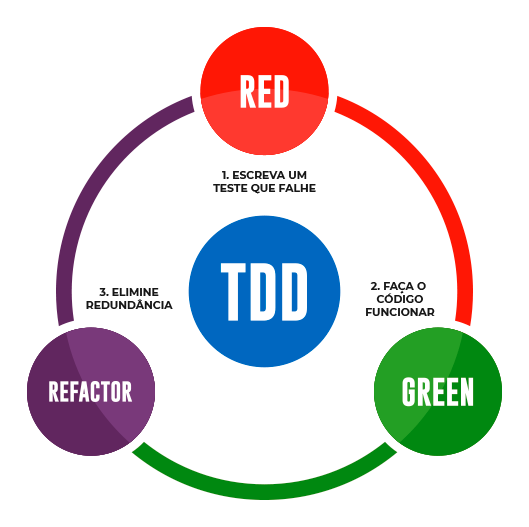

# TDD com Python
<<<<<<< HEAD
=======

`Projeto de estudo do TDD com a linguagem Python.`

>>>>>>> 331742f25946f17ebb385c4621564e4f91792b1b

`Projeto de estudo do TDD com a linguagem Python.`

#
## Como executar esse projeto em sua máquina?


1. **Primeiro passo:** Instalar as dependências do projeto:
   
   ~~~
   pip install -r requirements.txt  
   ~~~
2. **Segundo passo:** Executar Pytest:
   
   ~~~
   pytest
   ~~~
#
## **Estrutura Básica do Projeto**
~~~
projeto/
|
|--htmlcov/ (Relatório de Testes)
|
|--src/ (Código fonte)
|   |
|   |--tests/ (Pasta de testes)
|        |
|        |--classes/ (Classes base para teste)
|        |    |
|        |    |--funcionario.py (Classe a ser testada)
|        |
|        |--test_funcionario.py (Classe de teste)
|
|--venv/ (Ambiente virtual)
|
|--.coveragerc (Arquivo de configuração do Pytest Cov)
|
|--pytest.ini (Arquivo de configuração do Pytest)
~~~
#
## **O que é o ```TDD```** ?
>**TDD** é uma sigla para (**Test Driven Development**), ou *Desenvolvimento Orientado a Testes*. A ideia do TDD é que você trabalhe em ciclos. Estes ciclos ocorrem na seguinte ordem:

1. Primeiro, ***escreva um teste unitário*** que inicialmente irá falhar, tendo em vista que o código ainda não foi implementado;
   
2. ***Crie o código*** que satisfaça esse teste, ou seja: implemente a funcionalidade em questão. Essa primeira implementação deverá satisfazer imediatamente o teste que foi escrito no ciclo anterior;
   
3. Quando o código estiver implementado e o teste satisfeito, ***refatore o código*** para melhorar pontos como legibilidade. Logo após, execute o teste novamente.

   
## **Fluxo do TDD**
#
   
<div style="text-align:center">
    
</div>

#

* <span style="color:red">**Red:**</span> escreva um pequeno teste automatizado que, ao ser executado, irá falhar;
  
* <span style="color:green">**Green:**</span> implemente um código que seja suficiente para ser aprovado no teste recém-escrito;
  
* <span style="color:purple">**Refactor:**</span>  refatore o código, a fim dele ser melhorado, deixando-o mais funcional e mais limpo.
  
## **Quais os benefícios do `TDD` ?**

* Existem diversos benefícios ao escrevermos os testes antes mesmo de realizar uma implementação.
   
*  Um dos benefícios é que, como você vai saber o que o código precisa fazer antecipadamente, evitando escrever código complexo ou que não siga os pré-requisitos de negócio.
*  Além disso, se você for deixar para testar as funcionalidades do seu código depois, você pode acabar não realizando os testes como deveria.
  
#
## **Como fazer testes unitários?**
  * Existem diversas ferramentas para realização de testes unitários. Alguns exemplos para diferentes linguagens são:


> Linguagem   | Ferramenta
> --------- | ------
> .NET | `NUnit`
> PHP  | `PHPUnit`
> Node.js | `Jest`
> Java | `JUnit`
> Python | `Pytest`
#
## **Como fazer TDD em Python ?**
* O **```Pytest```** é a ferramenta mais utilizada para fazer testes unitários com o Python! 
  
* O pytest é um framework de teste para python que provê soluções para executar testes e fazer validações diversas, com a possibilidade de estender com plugins e até rodar testes do próprio unittest do python.
* É o queridinho da comunidade por sua flexibilidade, pela forma que usa fixtures e pela facilidade de estender suas funcionalidades.
  
#
### **Instalação do Pytest:**
~~~~
pip install -U pytest
~~~~
#
## Comandos básicos do Pytest

1. Executar testes:
   
   ~~~
   pytest
   ~~~
   Execução detalhada (Verbose)
   ~~~
   pytest -V
   ~~~

#
## **Cobertura de testes (`Coverage`)**
> Diz respeito a quanto do nosso código está coberto por testes. O ideal é que todas a funcionalidades sensíveis estejam cobertas por testes unitários.

Para verificar a cobertura do nosso código o pytest dispõe de uma extensão chamada (**pytest cov)**.

## Instalando o pytest cov:
~~~
pip install pytest-cov
~~~
## Executando o pytest cov:
~~~
pytest --cov
~~~


